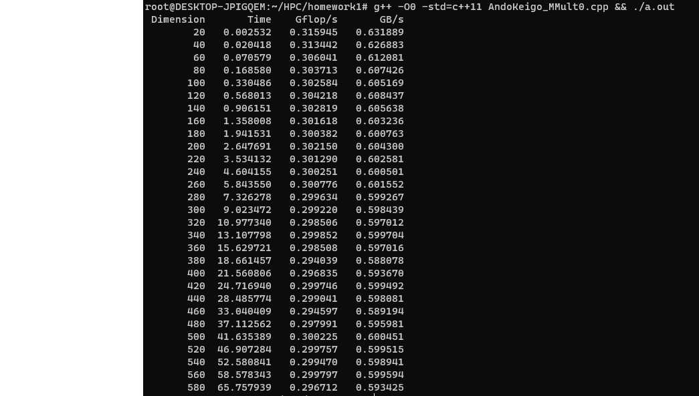
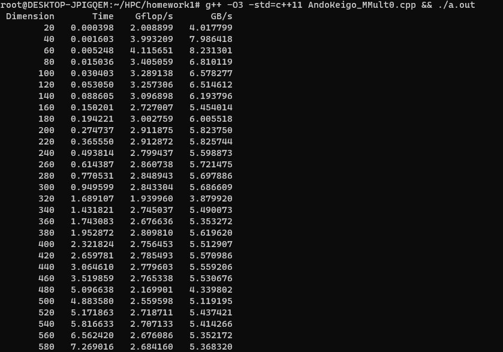

# HPC Spring 2023: Advanced Topics in Numerical Analysis:
## Assignment 1

Keigo Ando (ka2705)

## Problem2

My implementation can be seen in the source file `AndoKeigo_MMultO.cpp`

The processor I used for thsi assignment is an 8 core AMD Ryzen 7 4700 with Radeon Graphics. Cpu MHz is 1996.193 and cache size is 512 KB. And the program is executed on the WSL2 enviroment.

The flop rate and bandwidth for each optimizaion flag are as follows:

- -O0

- -O3

## Problem3 
### (a) (b)
See the source file `AndoKeigo_LaplaceEq.cpp`

### (c)
The number of iterations for each methods for different numbers can be seen as follows:

|  N     | Jacobi Method  | Gauss-Seidel Method | 
| ----:  | ----:          |----:                |
|  10    |  222           |    112              |
| 1000   |  1848917           |  924460                   |
| 100000 |  Do not converge after 1000000 interations  |  Do not converge after 1000000 interations   |

The following table describes run times for N = 100000 for 50 iterations with Gauss Seidel method using different compiler optimization flags. (It took an inordinately long time to run the program with optimization flag -O0, I did that with 50 instead of 100 for the maximum iteration.)

| Opt flag | Run times (s) |
| ----: | ----: |
| -O0   | 2276.006599 |
| -O3   | 627.933401    |

I also implement the program `AndoKeigo_LaplaceEq_modi.cpp` for faster computation to avoide a large number of iterations in matrix computation (not paralrellizing but just reducing the number of operations in loop). However, I guess this implementation is out of the objectives of this assignement. So I include this file just for reference.

The computer architecture I used for this experiment is the same as in Problem 2. 
